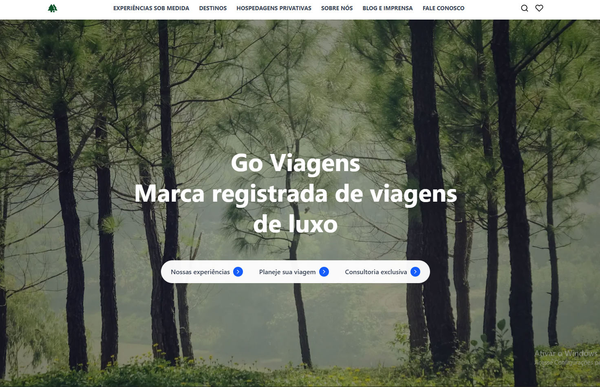

# Go Viagens

Este projeto foi desenvolvido por mim como forma de aprofundar meus estudos em frontend, principalmente na criacao de landing pages com React.

A ideia foi sair do basico e praticar um projeto mais visual, pensando nao so em interface, mas tambem em organizacao de componentes, responsividade, animacoes, performance e deploy em ambiente real.

## Preview

## Acesso

Pagina publicada no GitHub Pages:

https://ricardo-dev-00.github.io/Go-Viagens/

## Objetivo do projeto

Criei este projeto para estudar na pratica pontos que considero importantes na minha evolucao como desenvolvedor frontend:

- melhorar minha base em React
- praticar criacao de pages com foco visual
- organizar uma interface por secoes e componentes reutilizaveis
- aplicar conceitos de responsividade, performance e deploy

## Tecnologias utilizadas

- React
- Vite
- Tailwind CSS
- JavaScript
- React Icons
- ESLint
- GitHub Actions
- GitHub Pages

## Organizacao do projeto

Uma das coisas que eu quis treinar aqui foi a organizacao do projeto. Por isso, separei a estrutura por secoes visuais da pagina, deixando cada parte mais facil de entender, manter e evoluir.

### Estrutura principal

- `src/components/Header`: cabecalho, navegacao e menu mobile
- `src/components/Hero`: secao principal de destaque
- `src/components/Travel`: cards e conteudo da secao de viagens
- `src/components/Aviatour`: secao com timeline e argumentos da experiencia
- `src/components/Discover`: destinos em destaque
- `src/components/CTA`: bloco final de chamada para contato
- `src/components/Footer`: rodape da pagina
- `src/components/UI`: componentes utilitarios, como animacoes reutilizaveis
- `src/pages`: composicao da pagina principal
- `public/images`: imagens estaticas usadas no projeto

Essa divisao me ajudou a trabalhar melhor a separacao de responsabilidades e a pensar no projeto de forma mais escalavel.

## Funcionalidades trabalhadas

- layout responsivo para diferentes tamanhos de tela
- componentes organizados por secao
- animacoes de entrada leves
- otimizacao de imagens
- code splitting
- deploy automatico com GitHub Actions

## Scripts disponiveis

- `npm run dev`: inicia o ambiente local
- `npm run build`: gera a versao de producao
- `npm run preview`: visualiza localmente o build final
- `npm run lint`: executa a analise de codigo

## Deploy

Tambem usei este projeto para praticar uma etapa que muitas vezes fica de lado nos estudos: publicacao.

O projeto esta configurado para deploy no GitHub Pages com GitHub Actions.

O workflow faz:

1. instalacao das dependencias
2. build da aplicacao
3. publicacao automatica da pasta gerada

## Aprendizados

Durante o desenvolvimento, esse projeto me ajudou a reforcar varios pontos na pratica:

- estruturacao de interfaces em React
- separacao de responsabilidades entre componentes
- melhoria de performance em projetos frontend
- configuracao de deploy para ambiente real

Mais do que construir uma pagina visual, esse projeto foi importante para eu exercitar processo, organizacao e cuidado com detalhes de implementacao. Foi um projeto pensado como estudo, mas com preocupacao real de entrega.
